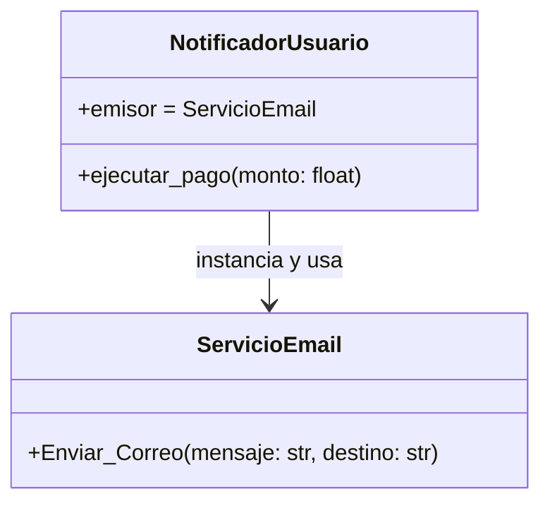

```mermaid
classDiagram
    direction    topDown

    class ServicioEmail{
        +Enviar_Correo (mensaje: str, destino: str)
    }

    class NotificadorUsuario {
        +emisor = ServicioEmail
        +ejecutar_pago(monto: float)
    }

    %% Dependencia directa y clases aisladas
    NotificadorUsuario --> ServicioEmail : instancia y usa
```