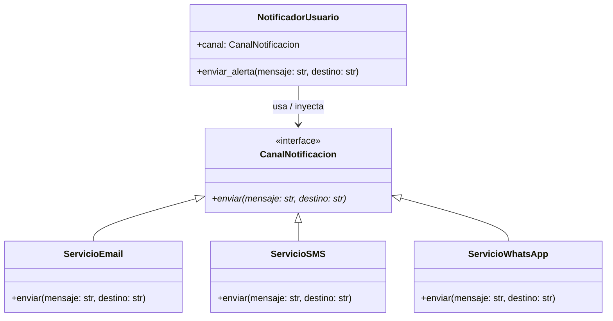

```mermaid
classDiagram
    direction    topDown

    class CanalNotificacion {
        <<interface>>
        +enviar(mensaje: str, destino: str)*
    }

    class ServicioEmail {
        +enviar(mensaje: str, destino: str)
    }

    class ServicioSMS {
        +enviar(mensaje: str, destino: str)
    }

    class ServicioWhatsApp {
        +enviar(mensaje: str, destino: str)
    
    }

    class NotificadorUsuario {
        +canal: CanalNotificacion
        +enviar_alerta(mensaje: str, destino: str)
    }

    %% Relaciones de herencia/implementación
    CanalNotificacion <|-- ServicioEmail
    CanalNotificacion <|-- ServicioSMS
    CanalNotificacion <|-- ServicioWhatsApp

    %% Relación de dependencia / Inyección de dependencias
    NotificadorUsuario --> CanalNotificacion : usa / inyecta
```