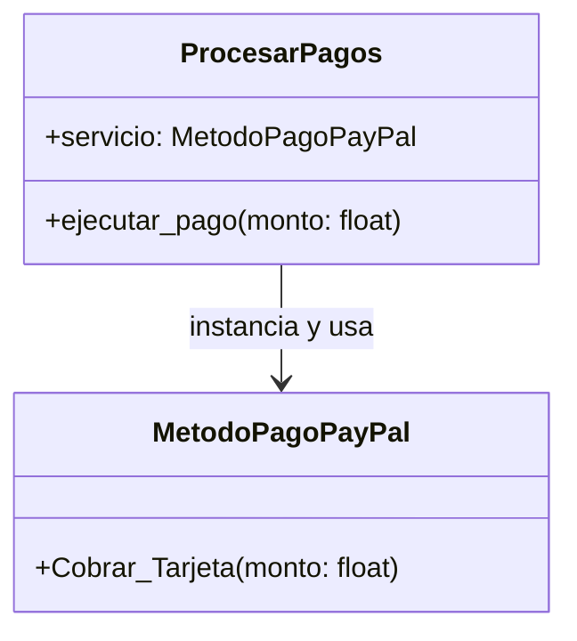

```mermaid
classDiagram
    direction    topDown

    class MetodoPagoPayPal {
        +Cobrar_Tarjeta(monto: float)
    }

    class ProcesarPagos {
        +servicio: MetodoPagoPayPal
        +ejecutar_pago(monto: float)
    }

    %% Dependencia directa y clases aisladas
    ProcesarPagos --> MetodoPagoPayPal : instancia y usa
```