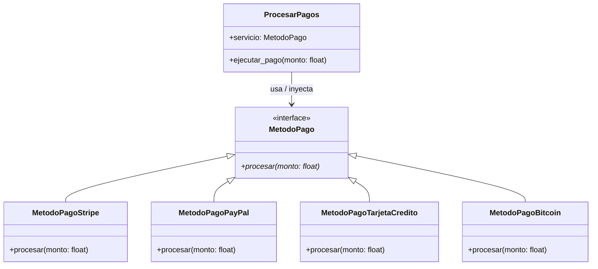

```mermaid
classDiagram
    direction    topDown

    class MetodoPago {
        <<interface>>
        +procesar(monto: float)*
    }

    class MetodoPagoStripe {
        +procesar(monto: float)
    }

    class MetodoPagoPayPal {
        +procesar(monto: float)
    }

    class MetodoPagoTarjetaCredito {
        +procesar(monto: float)
    }

    class MetodoPagoBitcoin {
        +procesar(monto: float)
    }

    class ProcesarPagos {
        +servicio: MetodoPago
        +ejecutar_pago(monto: float)
    }

    %% Relaciones de herencia/implementación
    MetodoPago <|-- MetodoPagoStripe
    MetodoPago <|-- MetodoPagoPayPal
    MetodoPago <|-- MetodoPagoTarjetaCredito
    MetodoPago <|-- MetodoPagoBitcoin

    %% Relación de dependencia / Inyección de dependencias
    ProcesarPagos --> MetodoPago : usa / inyecta
```